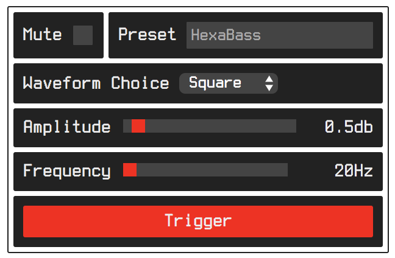

# uibot
UIBot is a JavaScript library for quickly generating input controls such as text input, sliders, menus, buttons and toggles, nearly automatically. UIBot is intended to be used for rapid prototyping and interactive visualizations.



## Basic Example
In the example below, two range sliders are added to the container supplied to the `build()` method in the last line. The first slider is labeled "Amplitude" and provides values between 0 and 1 in increments of .01. The second slider has the label "Frequency", and provides values between 1 and 20000 in increments of 1. Note that it also appends a unit of measure ("Hz") to the current value. The property called `defaults` is an array of variable names that will have components created for it with default settings. In this case the `enabled` property is a `boolean` so it will be represented by a checkbox, with a label containing the text "Enabled".

> Note: `params` is an array of objects. Each object represents a row of UI elements.

```js
var oscillator = {
    amp : 0.5,
    freq : 440,
    enabled : false
}

var params = [{
    // Set parameters for amplitude property
    amp : {
        step : .01,
        range : [0, 1.0],
        label : 'Amplitude'
    },
    // Set parameters for frequency
    freq : {
        step : 1,
        units : 'Hz',
        label : 'Frequency',
        range : [1, 20000]
    },
    // Create a default component for all properties in the following list
    defaults: ['enabled']
}]


function on_change(event) {

}

var uibot = UIBot();
var container = document.getElementById('uibot-wrapper');
var ui = uibot.build(oscillator, params, container, on_change)
```

## Two-way Binding
UIBot supports two-way data binding. That is to say that changes made to properties on the target object will be reflected in the UI. Binding is simple. Once your UI is created simply call the `bind()` method. You can optionally pass a value in milliseconds to the bind method indicating how often variables that are bound should be updated. The default is 500 milliseconds.

```js
uibot.bind();
```

If you wish to cancel binding, call the `unbind()` method.
```js
uibot.unbind();
```

## Datatypes
UIBot uses the data-type of the parameter to determine what kind of input to create. From the example above, UIBot will see that the amplitude property of the `oscillator` is a number and will create a slider control. UIBot will use defaults where properties are omitted. For instance, if the `step` property were to be left out of the frequency parameter, it would default to a value of .01.

Below is a list of supported data-types and the components that are created for each:

- Number: Creates a slider or a select menu if an "options" property is specified
- String: Creates a text input field or a select menu if an "options" property is specified
- Boolean: Creates a checkbox
- Function: Creates a button that triggers the function when pressed

## Parameter Object Specification
Datatype: `Function`<br/>
Element Type: Button

```js
function_name : {
    // User friendly version of function name, used as label
    // Default: function name
    // Optional
    label : “My Variable”

    // A list of arguments to supply to the function
    args : [arg1, arg2]
}
```

Datatype: `Number`<br/>
Element Type: Slider or Select Menu
```js
variable_name {
    // User friendly version of variable name, used as label
    // Default: variable name
    // Optional
    label : “My Variable”,

    // Decimal or integer for number of steps between values
    // Rounded values can be enforced by supplying an integer
    // Default: .01
    // Optional
    steps : .2,

    // Minimum and maximum
    // Defaults to [0-1]
    // Optional
    range : [0, 10],

    // Unit of measure to append to current value
    units : "unit type" (eg. Hz, lbs, mm),

    // A list of numeric options
    // If this exists,
    // step, range and units are ignored and a select element is used for this variable
    // Optional
    options : [1, 2, 3, 4, 5],
}
```

Datatype: `String`<br/>
Element Type: Text Input or Select Menu
```js
variable_name : {
    // User friendly version of variable name, used as label
    // Default: variable name
    // Optional
    label : “My Variable”,

    // Minimum and maximum text length restriction
    // Negative values indicate no restriction
    // Default: no restriction
    // Optional        
    maxLength : 10,

    // A list of text options
    // If this exists,
    // length, chars and charset
    // are ignored and a select element is used for this variable
    // Optional
    options : [‘a’, ‘b’, ‘c’, ‘d’]

    // A character used as a delimiter
    // Results in property being set to array
    // Optional
    delimiter : ','
}
```

Datatype: `Boolean`<br/>
Element Type: Checkbox
```js
variable_name : {
    // User friendly version of variable name, used as label
    // Default: variable name
    // Optional
    label : “My Variable”
}
```
